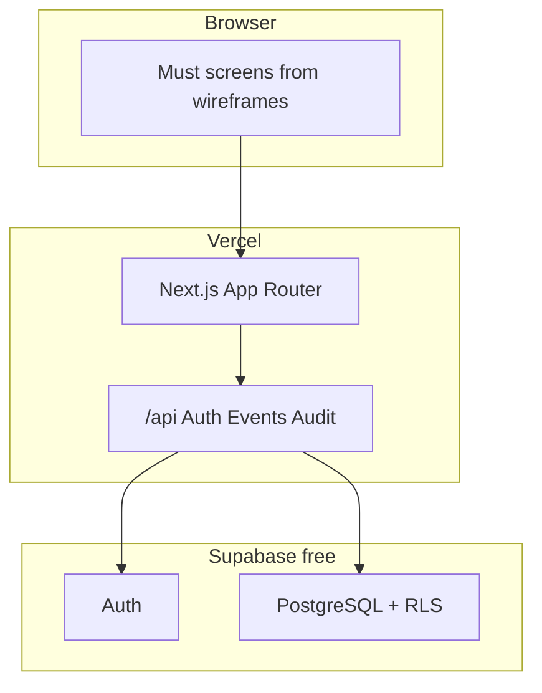

# Architecture one-pager

**Product:** Secure Volunteer and Event Coordination Platform (A01)  
**Team:** C262T-4104  
**Stack (locked M2):** Next.js (TypeScript) + Tailwind + Supabase (Postgres + Auth) + Vercel Hobby ($0).

## Why this shape

One deploy for the Tuesday demo. API contract is `design/openapi.yaml`. Data is `design/schema.md`. Security boundary is the Next.js server: the browser never holds the service role key.

## Environments

| Name | URL | Data |
|---|---|---|
| Local | http://localhost:3000 | local `.env` + Supabase project |
| Preview | Vercel preview | synthetic seed |
| Production demo | Vercel Hobby | synthetic seed; wipe at handover |

## Ops rules

- `.env` is gitignored. Template: `.env.example`.
- README for the app: `docs/README.template.md` (copied over the root README’s “how to run” section at M5).
- Demo banner and AU chrome on every page.
- Health: if Vercel or Supabase free-tier sleeps, Nishanth documents a restart path in the runbook (M5).

## What is not in the diagram

SSO, Redis, extra regions, native apps — Won’t.
