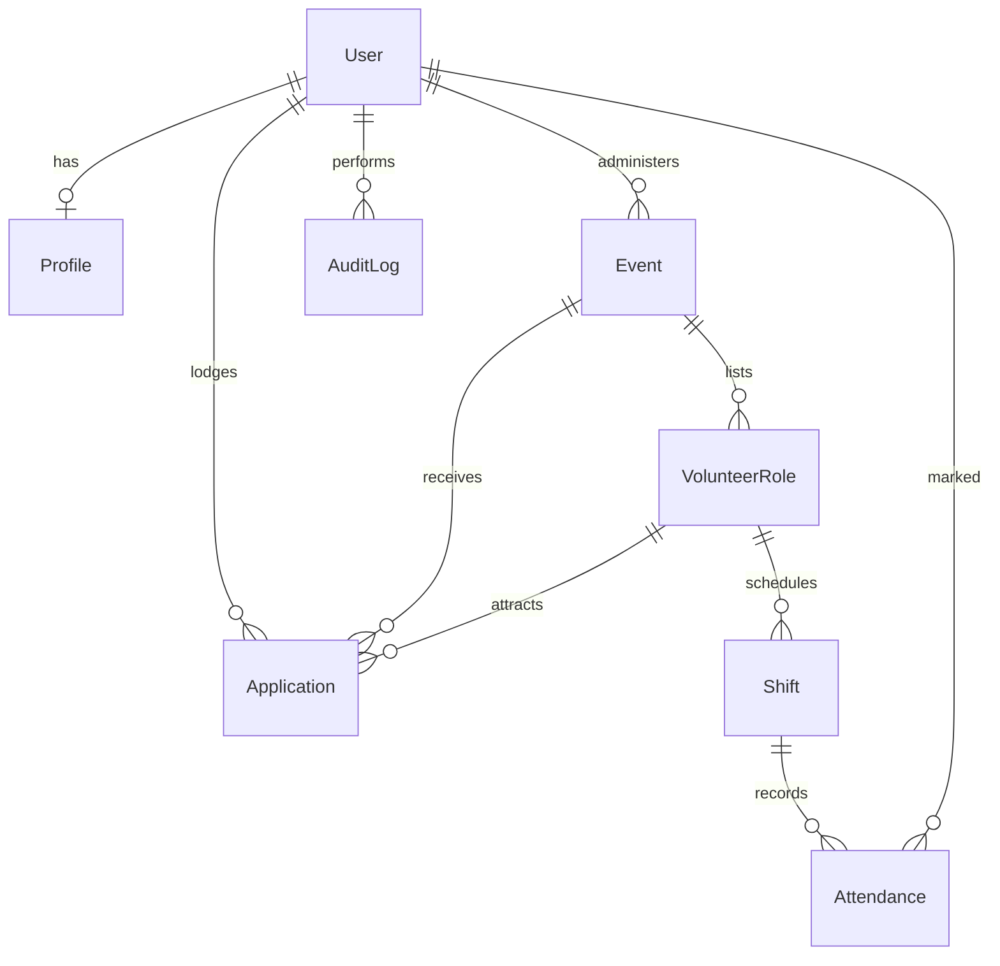

# ERD outline

Entities and relationships only. Columns, types, and SQL are in `design/schema.md`.

Must tables are required for the demo. Should/Could tables are stubbed so later features still have relations.

## Must (build in M5–M6)

- **User** — `id`, role (`admin` \| `student`), email unique, display name, auth provider key. No password column in our tables if Supabase Auth holds secrets.
- **Event** — `id`, `title`, `location`, `department`, `starts_at`, `ends_at`, `description`, `created_by`, timestamps, optional `deleted_at`. Location and department are filter and recommendation inputs.
- **AuditLog** — `id`, `actor_id`, `action`, `entity_type`, `entity_id`, `created_at`, optional metadata JSON (no secrets).

## Should (stub relations now)

- **Profile** — `user_id` PK/FK, department, campus, bio. Student-owned.
- **VolunteerRole** — belongs to Event; title, requirements, slots.
- **Application** — Student + VolunteerRole; status (`submitted` \| `accepted` \| `declined`).

## Could (stub relations now)

- **Shift** — VolunteerRole + assigned User + window.
- **Attendance** — Shift + User + present/absent.

## Recommendation (no extra table)

Compute on read from Event rows:

1. Same `location` as the opened event
2. Same `department`
3. Similarity: overlapping title/description tokens

Do not store browsing history of real people. Similarity uses the opened Event id in the request.

## Integrity

- FK from Event.created_by → User
- Student cannot be created_by for an Event in API rules (RBAC), even if the column type would allow it
- Unique (email) on User
- Cascade: deleting an Event (or soft-delete) must not orphan audit rows
