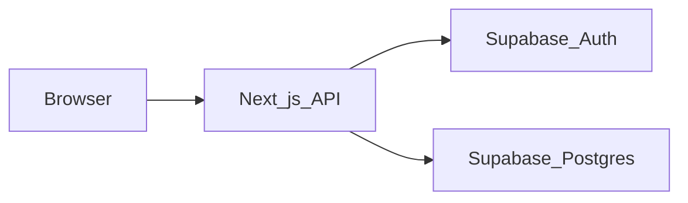

# Threat model (Must product)

**Method:** STRIDE on Must surfaces. Assets: volunteer-shaped demo data, Admin actions, session, reputation of Adelaide University branding.

Trust boundary: browser ↔ Vercel (Next.js) ↔ Supabase Auth/Postgres.

| Threat | STRIDE | Example | Mitigation (design) | Residual |
|---|---|---|---|---|
| Stolen session used as Admin | Spoofing | XSS + cookie | HttpOnly cookie, no innerHTML of event fields, CSP in M5 | XSS in a dependency |
| Student calls POST /events | Elevation | Hidden form | Server role check; RLS insert denied | Mis-set role in `users` |
| Register as Admin | Elevation | Extra JSON field `role=admin` | Ignore client role; force student | Seed Admin password leak |
| Mass-assign extra columns | Tampering | `created_by` spoof | Allowlist EventWrite schema | ORM default open |
| SQLi / XSS in title | Tampering | `<script>` in title | Parameterised SQL; encode on render; length cap | Stored XSS if we `dangerouslySetInnerHTML` |
| Recommend leaks deleted events | Info disc. | Soft-delete forgotten | `deleted_at is null` on all reads | Cache |
| Audit used as PII dump | Info disc. | metadata has email of others | metadata = field names only | Over-logging |
| Demo mistaken for official AU | Repudiation / reputational | No banner | Persistent demo banner US-M01 | Screenshot without banner |
| Brute force login | DoS / spoofing | Password spray | Supabase rate limits; 12-char demo passwords | Free-tier limits |
| Service role key in client bundle | Info disc. | NEXT_PUBLIC_SERVICE_ROLE | Env rule in `.env.example` | Human error |
| Real classmate email in seed | Privacy | “realism” | Synthetic-data rule | UAT tester types real email — consent + wipe |

## Abuse cases Jay must fail

1. Student JWT/session on `POST /api/events` → 403, no row, no audit of success.
2. Unauthenticated `GET /api/events` → 401 (Must product is signed-in explore).
3. `PATCH` with `role` or `id` in body does not change identity.
4. Title of 5000 chars → 400.
5. Opened event id is not inside its own recommendation lists.

## What we explicitly accept

- No WAF beyond Vercel defaults.
- No paid pentest.
- No university SSO (stolen campus password is out of scope for *this* app; testers must not reuse campus passwords — UAT script).
